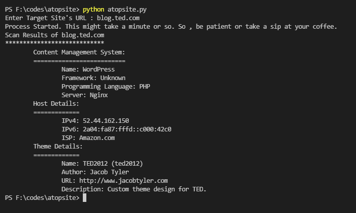

# ATOPSITE
Detects the Content Management System , Host Details , Theme Details of Websites and Web Apps.

NOTE: Theme detection only works with Wordpress sites.

## Requirements
This tool needs these things to work:
* Git (Optional)
* Python3
* whatcms.org api key
## How To Run
```sh
git clone https://github.com/NurTasin/atopsite.git
cd atopsite
```
Then get the API Key from whatcms.org and put it in the config.py file or create an environment variable named `ATOPSITE_API_KEY` with API Key of whatcms.org . After finishing this step run these commands.
```sh
pip3 install -r requirements.txt
python3 atopsite.py
```
## Screenshot
